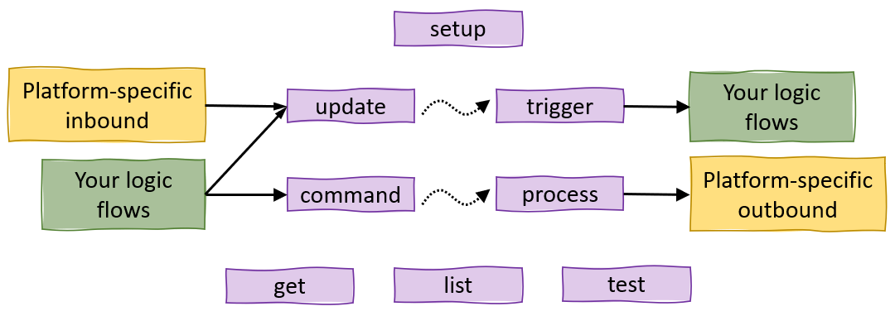

# Things for Node-RED

A set of [Node-RED](https://github.com/node-red/node-red) nodes that uses an agnostic state management system to keep IOT device states and provide a uniform control system.

   
  

**[Upgrading from v2?](#upgrading-from-v2)**

### Purpose

First, what these nodes do **not** do: These nodes have no connection outside of Node-RED. They will not directly receive any data, and they do not directly send any data.

This is an internal system that will help manage your Node-RED project better, minimizing overhead and simplying flows. You provide the outside connections, wire them up correctly to these nodes, and you will have a super charged version of Node-RED. The system is designed to be as minimalistic as possible, while allowing for just about any use case.

### Usage

The core concept is to reduce all IOT devices into one common "langauge". With that, flows are more sensible and changes are easier. To facilitate the abstractness of this library, it is broken into four main segments/nodes.

- The inputs from various platforms of your choice are linked into the **_update_** node, which will route to...
- The **_trigger_** node, which will link into your logic.
- Your logic may link into a **_command_** node, which will route to...
- The **_process_** node, which will link back to the various platforms.

Exact usage can vary depending on your use-case. However, this system was designed with the following general concept in mind. This is an over simplified representation. The two connections in the middle represent some of the inner-workings of this system.

The **_get_**, **_list_**, and **_test_** nodes are to help assist in your flows.

### Inspiration

This library was started because I was using Lifx, TP-Link/Kasa, Harmony, Z-Wave, and several other "things", and I wanted to be able to treat all lights, sensors, etc as equals, without worrying too much what platform they use.

A lot of the ideas used in this library are based off of a standard state management system, specifically React and Redux.

I also tried to use as much built-in functionality as possible, to keep with the themes of Node-RED. For example, the _ready_ node works very similar to the built-in _inject_ node. And many other properties are formed using Node-RED style inputs.

Lastly, I used node status, as much as possible, to assist with debugging. I've found that nodes with some sort of useful status are much more powerful than those without. Debug options are also available on most nodes.

### What is a Thing?

A **_thing_**, as used in this library, is any device or entity in Node-RED that you want to either keep state on, trigger off state changes, and/or control. These could be simple devices such as lights and sensors, or they could be more complex devices such as thermostats and entertainment devices, or even abstract "things", such as people.

This library of nodes does not actually connect to any of the devices; it only acts as a state management system. All outside communication will need to go through another Node-RED node. For example, if using Lifx lights, you will need one of the Lifx Node-RED libraries.

All _things_ configured in the setup nodes are listed in the **Things Directory** sidebar tab after deployment.

### Upgrading from v2

Version 3 has been designed to automatically upgrade any nodes from version 2. The main difference is how the configuration data is stored for the _setup_ node. Therefore, it is **highly recommended** to backup your `flows.json` file before upgrading. After upgrading to version 3, it is **recommended** to open every _setup_ and _trigger_ node you have and verify that they remain configured as you want. Many tests have been done to ensure everything upgrades properly, but of course there is always a chance for something to go wrong. Please report any bugs you encounter.

**Other major changes from v2 to v3:**

- The concept of "Groups" has been morphed into Children, and available for any `type`.
- The two parts of the "Proxy" system have moved. State proxies are now part of the State setup. And command proxies are now part of the Command setup. See [Setup](#setup) below.

## Nodes

There are 8 nodes included: _setup_, _update_, _trigger_, _get_, _test_, _list_, _command_, and _process_.

### setup

All _things_ must be configured using this node. Use a different _setup_ node for each _type_ that you have. It is up to you how you organize your _types_. But it is recommended to base them on the platforms you use - or in other words, based on how the devices connect in to and out of Node-RED. There are no inputs or outputs for this node. All things listed will be created when the flows are deployed.

##### Properties

| Property   | Info                                                                                                                                                               |
| ---------- | ------------------------------------------------------------------------------------------------------------------------------------------------------------------ |
| Thing Type | User's choice. Typically, the platform that these _things_ use to connect outside of Node-RED.                                                                     |
| Things     | Each _thing_ of this `type` is listed. Click a _thing_ to see detailed setup properties.                                                                           |
| (common)   | Optional. Each `type` can have common State, Commands, or Status Function. These get applied to all _things_ of this `type` unless overriden at the _thing_ level. |

**For each thing:**
| Property | Info
| -------- | --------- |
| Name | Required. Must be unique among **all** _things_
| ID | Optional. Must be unique among all _things_ of same `type`
| Props | Optional. Static properties
| State | Optional. Initial state and proxied states. <ul> <li> On re-deployment, static values will only initialize if key is not already assigned. </li><li> Proxied states can point to another _thing_ or own `children`. </li><li> Proxied states can refer to the same key or a different key. Or, if using a custom function for all `children`, then the entire state can be used. </li><li> Custom function is given an array of `values`. Output should be the reduced state for _thing_. </li> </ul>
| Commands | Optional. Special actions to take when handling commands. <ul> <li>Any command not listed will be processed as the _thing_ itself **and** will also be sent to all `children`. If this is not desired, configure it here. </li><li> Configure a specific type of command, or use `test` to do a regex test. </li><ul><li> Key-type can be used for object-style commands. </li></ul><li> Commands can be configured to be processed as self only, forwarded to `children` only, or forwarded to another _thing_. </li><li> Commands can be transformed to other commands before being processed/forwarded. </li><ul><li> If using a key-type command and also using a transform, then the key can be transformed and the value will stay. </li></ul> </ul>
| Children | Optional. A list of other _things_. <ul> <li> Children can be used to create a dynamic state for the parent _thing_. Use `State` to configure. </li><li> All commands are automatically forwarded to all children, unless configured differently in `Commands`. </li> <li>The parent-child relationship can be many-to-many.</li> </ul>
| Stautus Function | Optional. A function that runs to determine the status of a _thing_. Function is run with current `state` and `props` as input, and should output a node status object. The object can contain `text`, `fill`, and/or `shape`. If a thing has its own status function, that will be used. Otherwise the `type`-level status function will be used.

### update

A node that will update a _thing_'s state, potentially causing a separate _trigger_ node(s) to output. Use is flexible and can be configured in a few ways.

##### Properties

| Property          | Info                                                                                                                                                                                                                                                                                                        |
| ----------------- | ----------------------------------------------------------------------------------------------------------------------------------------------------------------------------------------------------------------------------------------------------------------------------------------------------------- |
| Thing Name        | Optional. When specified, all input messages will be directed to this thing. If not provided, the input message must include thing `name`.                                                                                                                                                                  |
| Update Properties | Optional. The `state` keys/values to be updated. If any updates are configured, then input `payload` will be ignored. To use input `payload` as the state update, the update properties list must be empty.                                                                                                 |
| Thing Type        | Optional. When specified, the node will watch for all _things_ of the `type` and update its status with any missing _things_. Additionally, if specified, input messages can optionally use <i>thing</i> <code>ID</code> instead of <code>name</code>. If not provided, the node will not display a status. |

##### Input

| Key       | Type      | Info                                                                                                                                                                                                                                  |
| --------- | --------- | ------------------------------------------------------------------------------------------------------------------------------------------------------------------------------------------------------------------------------------- |
| `topic`   | _string_  | Optional. _Thing_ `name`. Only used if not specified in properties. **Note:** will _not_ override property setting. Alternatively, if the node is configured with a _thing_ `type`, then the _thing_ `ID` can be used as the `topic`. |
| `payload` | _object_  | Optional. The `state` update. Ignored if any updates are set in properties.                                                                                                                                                           |
| `replace` | _boolean_ | Optional. If `true`, the new `state` will completely replace current `state`. Otherwise it will be merged, top-level only.                                                                                                            |

### trigger

A node that outputs a message when a thing's state changes. Can be configured in many ways.

##### Properties

| Property   | Info                                                                                                                                                                                                                                                                                                                                                                                         |
| ---------- | -------------------------------------------------------------------------------------------------------------------------------------------------------------------------------------------------------------------------------------------------------------------------------------------------------------------------------------------------------------------------------------------- |
| Thing Test | Test used to determine **what** _things_ to watch. Can be configured to check against any static attributes of each _thing_. List of matching <i>things</i> is made immediately after setup and is not updated until nodes are re-deployed. Each _thing_ is tracked individually. Editor will show how many _things_ match the current configuration. Click the number to see the full list. |
| Trigger    | Configure **when** to trigger an output. "All Updates" will trigger on any `state` update, regardless of changes. Use `state.` to track a specific `state` key. Leave empty to trigger on any `state` change. _Ignore initialization_ option will prevent triggers when the value changes from `undefined`.                                                                                  |
| Payload    | Configure what to output on `msg.payload`. Can be a typical Node-RED typed value, or part of the _thing_ `state`. Leave `state.` empty to output the entire state. Use the copy button to quickly copy the state field from the Trigger.                                                                                                                                                     |

##### Output

| Key       | Type     | Info                        |
| --------- | -------- | --------------------------- |
| `topic`   | _string_ | _Thing_ `name`              |
| `payload` | any      | Depends on Payload property |

### get

A node that will append specified values of a _thing_ to a message.

##### Properties

| Property   | Info                                |
| ---------- | ----------------------------------- |
| Thing Name | The _thing_ to reference            |
| Message    | Similar to the built-in inject node |

##### Output

Same message from input, with specified properties changed/added.

### test

A node that allows a message to pass based on specified conditions related to a _thing_. The message will not be modified.

##### Properties

| Property   | Info                                                                                |
| ---------- | ----------------------------------------------------------------------------------- |
| Thing Name | The _thing_ to reference                                                            |
| Conditions | The conditions that must be met to allow the message to pass through                |
| 2nd Output | Optionally choose to have a 2nd output that will pass the message if the test fails |

##### Input

| Key     | Type     | Info                                                                                                    |
| ------- | -------- | ------------------------------------------------------------------------------------------------------- |
| `topic` | _string_ | Optional. _Thing_ `name`, if not specified in properties. **Note:** will not override property setting. |

##### Output

Input message will be passed through

### list

A node that will list all _things_ that match the specified conditions.

##### Properties

| Property   | Info                                                                                                |
| ---------- | --------------------------------------------------------------------------------------------------- |
| Output     | Choose the type and value of the output                                                             |
| Property   | Specify what property to output on                                                                  |
| Conditions | The conditions that must be met to include a _thing_ on the list. Leave empty to list all _things_. |

##### Output

The input message will be forwarded (unless `Discard input message` is checked), with the addition of the output specified in the properties.

### command

A node that will initiate the sending of a command to a _thing_ or multiple _things_. Note that this node does not provide any communication to the outside. It will only relay messages to respective _process_ node(s).

The node will check for any command configuration for the _thing_ and transform/forward, if necessary. If there is no configuration, then the command is processed for self and also forwarded to all children.

##### Properties

| Property   | Info                                                                                                                                           |
| ---------- | ---------------------------------------------------------------------------------------------------------------------------------------------- |
| Thing Name | Optional. When specified, all input messages will be directed to this _thing_. If not provided, the input message must include _thing_ `name`. |
| Command    | Optional. When specified, will be used as the _command_. If not provided, the input must include the _command_.                                |

##### Input

| Key       | Type     | Info                                                                                          |
| --------- | -------- | --------------------------------------------------------------------------------------------- |
| `topic`   | _string_ | _Thing_ `name`, if not specified in properties. **Note:** will not override property setting. |
| `payload` | any      | The _command_, if not specified in properties. **Note:** will not override property setting.  |

### process

A node that will listen for messages from _command_ nodes for a specific _thing_ `type`, and then output the message. Note that this node does not provide any communication to the outside. It will only relay messages from repsective _command_ nodes. Its purpose is to funnel all messages intended for a certain node library into one place.

##### Properties

| Property   | Info                                                      |
| ---------- | --------------------------------------------------------- |
| Thing Type | The _thing_ `type` to listen for                          |
| Topic      | The property or custom string to send as the `msg.topic`. |

##### Output

| Key       | Type     | Info                                        |
| --------- | -------- | ------------------------------------------- |
| `topic`   | _string_ | As configured in properties                 |
| `payload` | any      | The _command_, passed from a _command_ node |
| `thing`   | _object_ | The entire thing object                     |

## Bugs and Feedback

For bug reports, feature requests, and questions please use the [GitHub Issues](https://github.com/hufftheweevil/node-red-contrib-things/issues).
